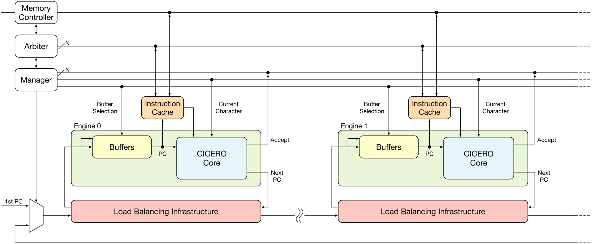
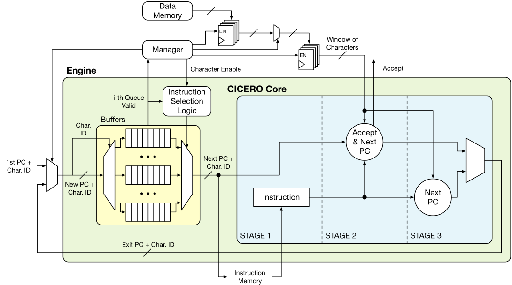

# CICERO: A Domain-Specific Architecture for Efficient Regular Expression Matching
 
Cicero is a domain specific architecture that can be employed to perform exact regular expression (RE) matching using FPGAs.
The cool fact about Cicero is that - as other software libraries one among the other RE2 - does not suffer from backtracking problem.
This means that when it elaborate a REs that carry some kind of non-determinsm (e.,g. a?a ) it does not take a guess and then backtrack but can explore all the different options in a single pass of the input string.

If you are interested in the topic take a look at [Russ Cox article](https://swtch.com/~rsc/regexp/regexp1.html)

Here it follows an high level overview of Cicero Engines and how they can be combined together.





Cicero has its own [compiler](https://github.com/ironmanna/xohw23-Hardware-and-Software-Optimization-for-regular-expression/cicero_compiler) that converts REs in our custom ISA.


If you find this repository useful, please use the following citation about the original implementation of CICERO at 16 bit:

```
@article{parravicini2021cicero,
    title = {{CICERO}: A Domain-Specific Architecture for Efficient Regular Expression Matching},
    author = {Daniele Parravicini and Davide Conficconi and Emanuele Del Sozzo and Christian Pilato and Marco D. Santambrogio}, 
    journal = {{ACM} Transactions on Embedded Computing Systems},
    year = 2021,
    month = {oct},
    publisher = {Association for Computing Machinery ({ACM})},
    volume = {20},
    number = {5s},
    pages = {1--24},
    doi = {10.1145/3476982},
    url = {https://doi.org/10.1145%2F3476982},
 } 
```
